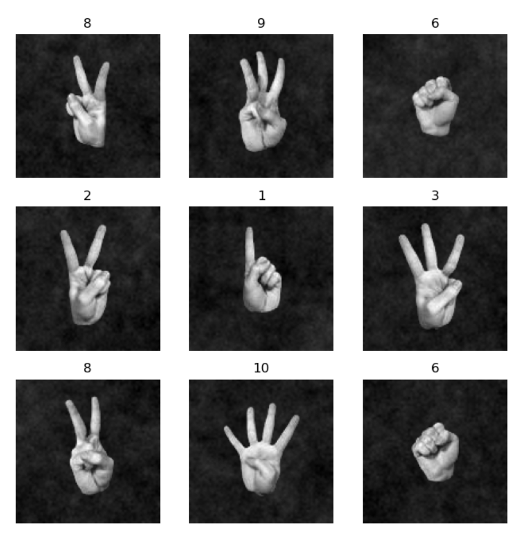

# Fingers Dataset - PyTorch CNN Implementation

This repository contains the code for a 2D Convolutional Neural Network (CNN) designed using PyTorch that classifies images of fingers indicating different numbers from 0 to 5 for both left and right hands.

## Dataset

The dataset used is named "fingers", and it consists of images with labels indicating the number of fingers shown and the hand used (left or right). 
The code transforms the labels such that it follows this table: 

 Label Class | Hand  | # of Fingers 
-------------|-------|---------------|
| **0**       | Left  |      0       |
| **1**       | Left  |      1       |
| **2**           | Left  |      2       |
| **3**           | Left  |      3       |
| **4**           | Left  |      4       |
| **5**           | Left  |      5       |
| **6**           | Right |      0       |
| **7**           | Right |      1       |
| **8**           | Right |      2       |
| **9**           | Right |      3       |
| **10**          | Right |      4       |
| **11**          | Right |      5       |

You can download the dataset from Kaggle at the following link:
[Fingers Dataset on Kaggle](https://www.kaggle.com/datasets/koryakinp/fingers/data)

## Network Architecture

The CNN architecture is defined in `network.py` with the following structure:

- An initial Convolutional layer with ReLU activation and Max Pooling.
- A flattening step to convert the 2D feature maps into a 1D feature vector.
- A fully connected layer to output the class scores.

The network applies a softmax function in the output layer to provide probabilities for each class.

## Training and Evaluation

The `trainer.py` script handles the training and evaluation of the model. The model is trained using a cross-entropy loss function and SGD optimizer. Data loading and preprocessing are handled by `setup_data.py`, which also includes a method to split the dataset into training and test sets. The main driver script is `main.py`, which orchestrates the training process over multiple epochs and evaluates the model's accuracy.

## Results

The model achieves a 100% accuracy rate on the test dataset, indicating that it can perfectly classify the number of fingers shown in the images.

## Usage

To use this code, clone the repository and ensure you have the necessary dependencies installed, including PyTorch. Run the `main.py` script to start training and evaluation. The scripts assume that the dataset is present in a directory as per the structure in `setup_data.py`.

For more details on how to use this code, please refer to the individual scripts:

- `network.py`: Contains the CNN architecture.
- `setup_data.py`: Prepares the data for training and testing.
- `main.py`: The main script to start the training process.
- `trainer.py`: Defines the training and evaluation routines.

Feel free to fork this repository and adapt the code to your own projects!
